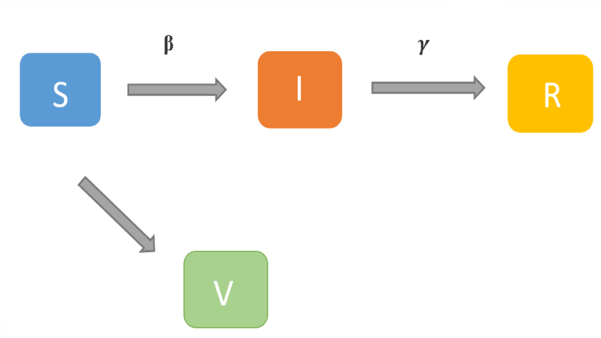
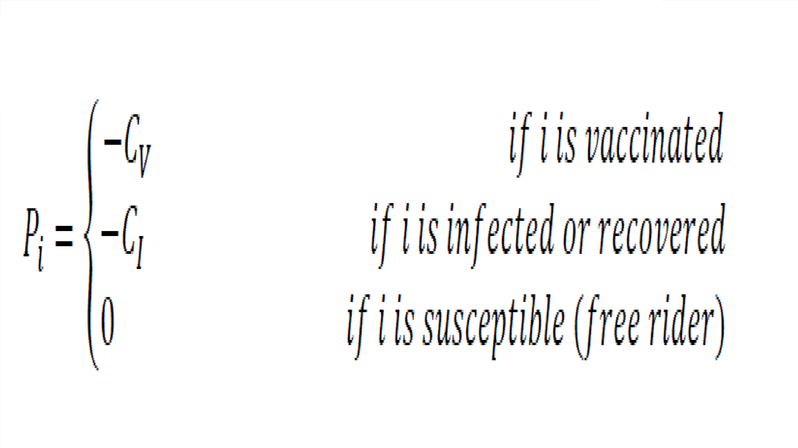
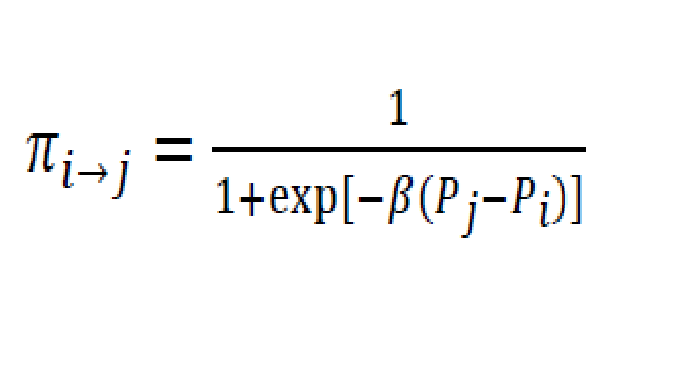
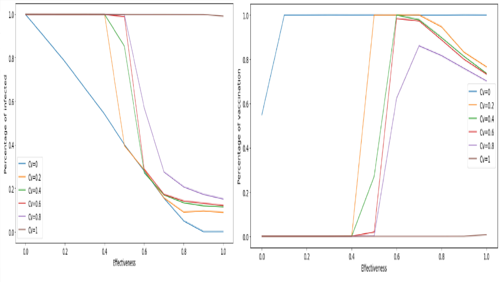
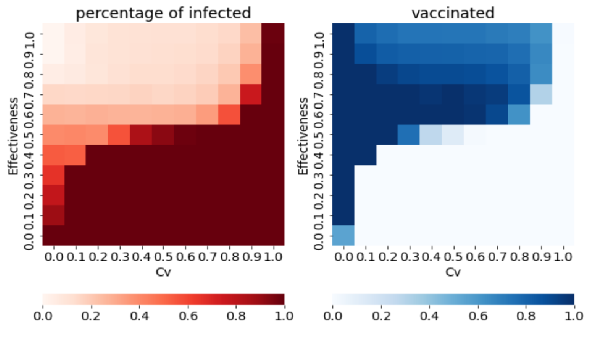

# Multi-agent-simulation_SIRV_gameTheory

## Abstract
In this project, a multi-agent simulation is built using SIRV (susceptible, infected, recovered, vaccination) for epidemic disease. An evolutionary game model is used for infectious disease vaccination strategies. The two strategies include vaccination and non-vaccination. This model considers factors such as vaccination cost, vaccination effectiveness, and treatment cost after illness. In a network, agents are nodes and are connected by edges. Each individual agent updates its game strategy according to the benefit relationship with the adjacent nodes with the help of policy update rule (Femi rule).  The results shows that the cost of vaccine effects the percentage of infection and percentage of vaccination. When the vaccination effectiveness is about 0.6, it is a better value for the evolution of vaccination strategy. 

## Steps
In this report, results can be seen for the analysis of the influence of factors such as the ways to get vaccinated, vaccination costs, and disease treatment costs by proposing an evolutionary game SIRV model of infectious disease vaccination strategy. The evolutionary game to make everyone in the network get two strategies, including vaccination and non-vaccination. At the same time, in each propagation process, each individual updates its game strategy according to the profit relationship with the adjacent nodes based on the policy update rule (PUR).

## SIRV
The SIR model is a 3-state model i.e. it divides the population into 3 populations. S is the susceptible individuals where individuals are not infected and also have no immunity. I is infected state where individuals are in the infected as they have exposed to the virus/infection. R is the recovered state where infected person is cured and had certain immunity. We assume that the susceptible people can have immunity through vaccine. So, the fourth state is introduced as vaccinators-state. So instead of classic SIR, we use SIRV model here. Moreover, a state called Immune state is also included. The people in the immune state are those whose vaccine has worked properly. If the vaccine has not worked on people, then they are same as the people who are not vaccinated so they will be in the susceptible state again.  The people are transformed from one state to other based on the probability value for different states. The probability of infection due to contact with one infected person is called as beta (β). The probability that a vaccine is effective is determined by the value of effectiveness. Recover from illness according to the recovery probability gamma (γ). The strategy model for the different states is explained in the next part of this report.

In this project, the agents are generated using networks library in python, where each nodes are the individual agents and edges are the contact of each agent to the other agent. The average degree for the contact is considered as 8 i.e an agent will come in contact with on average of other agents in the network. The network can be imagined something like the diagram shown below. Each nodes have one of the four states. A game-theory strategy is applied on these states to help in decision making for agents to decide whether to take vaccine or not. 

## Payoff and Femi 
Mathematically, if node 𝑖 is a S individual, it checks if its adjacent node contains an infected I. If not, the state of node 𝑖 in the next transmission process will still be S. If there is an I individual in the adjacent nodes, node 𝑖 will be infected with a certain probability during the propagation process and becomes I state. If node 𝑖 is an I individual, it will be transformed into a R individual with a certain probability.
Before/ongoing epidemic of an infectious disease, each agent will choose whether to vaccinate. When there are agents vaccinated (V) in the network, before the next infectious disease cycle, each agent will update his own vaccination strategy. Each agent’s attitude toward vaccination will be affected by aspects like as personal preferences, the cost of treatment, the cost of the vaccine, and so on. In this project, the analysis is done assuming that vaccination has no side effects, but the vaccination is not completely effective i.e., the vaccination may fail. If the vaccine fails, the agent will be in susceptible state else they will be in Immune state (IM). 

In any game theory, there are 3 components: Players, Strategy and Payoff. Here Players are the individuals are interacting with each other, strategies are based on the transmission model SIRV and the payoff of each agent is considered to be the probability of being infected at each time. The payoff of each individual is calculated along the way, which is important in the decision making of agent about getting the vaccine. An equation below is the payoff equation, where -Cv is the cost of the vaccine ranging from 0 and 1 if i is in vaccinated state. The payoff for individual in I state is -1. Here the negative value is considered because, its cost and mot a benefit. Zero for the individual in susceptible state.
 

Therefore, the proportion of vaccinated people and the proportion of infected people is calculated by the following steps: 1) Before the start of the first-time step (season), calculate infection dynamics by having half of all agents vaccinated. 2) Then when the infected person disappears, it is said as the time step (infectious season) has ended, and all the agents need to decide whether or not to vaccinate for the next time step. 3) Keeping the agents who decided to vaccinate in previous step as vaccinated individuals, the dynamics is recalculated. 4) This step is repeated until there is no change in the proportion of vaccinated people.
B.	Policy update rules:

Considering that individuals can make certain mistakes with limited rationality when making strategy so here, Femi update rule allows irrational probabilistic imitation. To update its strategy, an individual 𝑖 randomly chooses its own neighbor 𝑗 to compare the return values. The probability that the individual 𝑖 will adopt the strategy of its neighbor 𝑗 in the next game is given by the below equation, where Pi and Pj are the payoff of individuals 𝑖 and 𝑗 in this game respectively.

## RESULTS

The number of agents considered are 10,000 and the average degree of contact in the network is 8. The transmission probability is 0.4 for the adults between 18-45 and the recovery probability is 0.6, as the recovery for healthy adult for Covid-19 is high. The model is run for 1,000 time steps and for Cv values between 0 to 1. The proportion of infected individuals decreases as the effectiveness increases, and the proportion of vaccinated individuals increases. We can see that the effectiveness rate is 0.5-06, the proportion of infected persons is the lowest, and the proportion of individual vaccinated is the highest.

